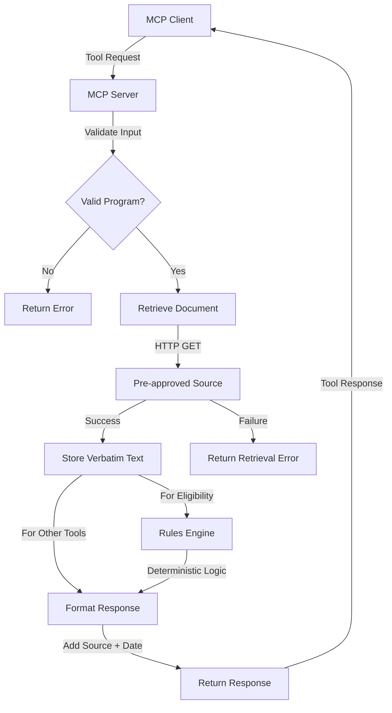

# Architecture Documentation

## Overview

The PlainGov MCP server implements a strict **retrieval-first architecture** that ensures all responses are grounded in official government sources. This document explains the technical design, architectural decisions, and compliance mechanisms.

## Core Principles

### 1. Retrieval-First

**Definition:** Every response must be based on freshly retrieved documents from pre-approved URLs.

**Implementation:**
- No cached responses
- No prior knowledge usage
- No assumptions or interpretations
- All content sourced from official documents

**Enforcement:**
- Tool handlers retrieve documents before any processing
- Retrieval failures return errors (no fallbacks)
- Source URLs and verification dates included in all outputs

### 2. Verbatim Storage

**Definition:** Retrieved text is stored and passed exactly as received from the source.

**Implementation:**
- No text modification or summarization
- No content filtering or editing
- Exact preservation of original formatting
- Direct pass-through to response

**Rationale:**
- Maintains accuracy and authenticity
- Prevents interpretation errors
- Ensures traceability to source
- Supports compliance and auditing

### 3. Deterministic Processing

**Definition:** Eligibility checks use rule-based logic, not LLM interpretation.

**Implementation:**
- Static rules engine for eligibility assessment
- Hardcoded thresholds and criteria
- No probabilistic or AI-based decisions
- Conservative assessments (err on side of caution)

**Rationale:**
- Predictable and consistent results
- No hallucination risk
- Auditable decision logic
- Compliant with constraint requirements

### 4. Fail Loudly

**Definition:** System errors on any constraint violation rather than providing fallback responses.

**Implementation:**
- Retrieval failures return error objects
- Invalid inputs rejected with clear messages
- No graceful degradation to prior knowledge
- Explicit error reporting

**Rationale:**
- Prevents misinformation
- Maintains trust and reliability
- Forces proper error handling
- Ensures compliance visibility

## System Architecture

### High-Level Architecture

```
┌─────────────────┐
│   MCP Client    │
│ (Claude Desktop)│
└────────┬────────┘
         │
         │ MCP Protocol (stdio)
         │
┌────────▼────────┐
│   MCP Server    │
│  (PlainGov)     │
├─────────────────┤
│ • Tool Handlers │
│ • Validation    │
│ • Orchestration │
└────────┬────────┘
         │
    ┌────┴────┐
    │         │
┌───▼───┐ ┌──▼──────┐
│Retrieval│ │ Rules   │
│ Engine  │ │ Engine  │
└───┬───┘ └──┬──────┘
    │         │
┌───▼─────────▼───┐
│  Response       │
│  Formatter      │
└─────────────────┘
```

### Component Breakdown

#### 1. MCP Server Core

**Responsibilities:**
- Protocol implementation (MCP SDK)
- Request/response handling
- Tool registration and discovery
- Error handling and reporting

**Technology:**
- TypeScript/Node.js
- `@modelcontextprotocol/sdk`
- Stdio transport

**Key Files:**
- [`plain-gov-mcp/src/index.ts`](../plain-gov-mcp/src/index.ts) - Main server implementation

#### 2. Sources Registry

**Purpose:** Maintain pre-approved government program URLs

**Structure:**
```typescript
interface Source {
  id: string;              // Unique program identifier
  name: string;            // Human-readable name
  url: string;             // Official government URL
  jurisdiction: string;    // Canada, Alberta, etc.
  category: 'taxes' | 'benefits' | 'business';
}
```

**Current Sources:**
- GST Credit (Canada.ca)
- Canada Child Benefit (Canada.ca)
- Alberta Family Employment Tax Credit (Alberta.ca)
- GST Registration (Canada.ca)
- Payroll Deductions (Canada.ca)

**Approval Criteria:**
- Official government domain only
- Publicly accessible
- Authoritative source
- Regularly maintained

#### 3. Retrieval Engine

**Purpose:** Fetch verbatim text from pre-approved URLs

**Function Signature:**
```typescript
async function retrieveDocument(url: string): Promise<
  { text: string; lastVerified: string } | 
  { error: string; details: string }
>
```

**Process:**
1. Validate URL against sources registry
2. Perform HTTP GET request
3. Check response status
4. Extract text content
5. Record verification timestamp
6. Return verbatim text or error

**Error Handling:**
- Network failures → Return error object
- HTTP errors (4xx, 5xx) → Return error with status
- Timeout → Return timeout error
- No fallback or retry logic

**Compliance:**
- No caching (always fresh retrieval)
- No text modification
- No prior knowledge usage
- Explicit error reporting

#### 4. Rules Engine

**Purpose:** Deterministic eligibility assessment without LLM

**Structure:**
```typescript
type EligibilityRule = (
  userContext: UserContext
) => EligibilityResult;

interface EligibilityResult {
  status: 'eligible' | 'not_eligible' | 'unclear';
  reasons: string[];
  missingInfo: string[];
}
```

**Implementation:**
- One rule function per program
- Hardcoded thresholds and criteria
- Conservative logic (favor "unclear" over "eligible")
- No interpretation or inference

**Example Rule (GST Credit):**
```typescript
gst_credit: (userContext) => {
  // Check for missing information
  if (userContext.income === undefined) {
    return { 
      status: 'unclear', 
      reasons: [], 
      missingInfo: ['income'] 
    };
  }
  
  // Apply conservative threshold
  if (userContext.income > 55000) {
    return { 
      status: 'not_eligible', 
      reasons: ['Income may be too high'], 
      missingInfo: [] 
    };
  }
  
  return { 
    status: 'eligible', 
    reasons: [], 
    missingInfo: [] 
  };
}
```

**Rationale:**
- No LLM involvement (constraint requirement)
- Predictable and auditable
- Conservative assessments
- Clear decision logic

#### 5. Tool Handlers

**Purpose:** Implement MCP tool interface for each operation

**Available Tools:**
1. `explain_program` - Retrieve and return program information
2. `get_eligibility_criteria` - Retrieve eligibility criteria
3. `eligibility_check` - Apply rules engine to user context
4. `generate_checklist` - Retrieve application checklist
5. `timeline` - Retrieve key dates and deadlines
6. `questions_for_professional` - Retrieve professional consultation guidance

**Handler Pattern:**
```typescript
case "tool_name": {
  // 1. Validate input
  const programId = args.program_id as string;
  const source = sources[programId];
  if (!source) throw new Error(`Program ${programId} not found`);
  
  // 2. Retrieve document
  const retrieval = await retrieveDocument(source.url);
  if ('error' in retrieval) {
    return { content: [{ type: "text", text: `Error: ${retrieval.error}` }] };
  }
  
  // 3. Process (if needed)
  // For eligibility_check: apply rules engine
  // For others: pass through verbatim
  
  // 4. Format response with source attribution
  const output = `${retrieval.text}\n\n**Source:** ${source.url} (last verified ${retrieval.lastVerified})`;
  
  return { content: [{ type: "text", text: output }] };
}
```

**Compliance:**
- Retrieval before any processing
- No LLM involvement (except future features)
- Source attribution in all responses
- Error propagation (no fallbacks)

#### 6. Response Formatter

**Purpose:** Ensure consistent output format with source attribution

**Format:**
```
[Retrieved or processed content]

**Source:** [URL] (last verified [YYYY-MM-DD])
```

**Requirements:**
- Always include source URL
- Always include verification date
- Preserve original content formatting
- Add disclaimers for eligibility checks

## Data Flow

### Request Flow Diagram



### Detailed Request Flow

1. **Client Request**
   - User invokes tool through MCP client
   - Client sends tool name and arguments via stdio
   - Server receives and parses request

2. **Input Validation**
   - Validate program_id against sources registry
   - Validate user_context schema (for eligibility_check)
   - Reject invalid inputs with clear error messages

3. **Document Retrieval**
   - Look up URL from sources registry
   - Perform HTTP GET request
   - Handle network errors and HTTP errors
   - Extract text content verbatim
   - Record verification timestamp

4. **Processing**
   - **For eligibility_check:** Apply rules engine to user_context
   - **For other tools:** Pass through retrieved text verbatim
   - No LLM involvement in current implementation

5. **Response Formatting**
   - Combine content with source attribution
   - Add verification date
   - Include disclaimers (for eligibility checks)
   - Format as MCP tool response

6. **Response Delivery**
   - Send formatted response to client via stdio
   - Client displays to user
   - User can follow source URL for verification

## Design Decisions

### Why Retrieval-First?

**Problem:** AI systems can hallucinate or provide outdated information.

**Solution:** Always retrieve from authoritative sources before responding.

**Benefits:**
- Accuracy and reliability
- Traceability to official sources
- Up-to-date information
- Compliance with regulations
- Trust and credibility

**Trade-offs:**
- Slower response times (network latency)
- Dependency on source availability
- No offline operation
- Higher operational complexity

**Decision:** Benefits outweigh trade-offs for government information domain.

### Why No LLM for Eligibility?

**Problem:** LLM could interpret eligibility criteria inconsistently or incorrectly.

**Solution:** Use deterministic rules engine with hardcoded logic.

**Benefits:**
- Predictable and consistent results
- No hallucination risk
- Auditable decision logic
- Lower operational cost
- Faster response times

**Trade-offs:**
- Less flexible than LLM
- Requires manual rule updates
- Cannot handle edge cases
- Limited to predefined criteria

**Decision:** Reliability and auditability are critical for eligibility decisions.

### Why Verbatim Storage?

**Problem:** Summarization or paraphrasing could introduce errors or bias.

**Solution:** Store and return text exactly as retrieved from source.

**Benefits:**
- Maximum accuracy
- No interpretation errors
- Direct traceability
- Legal defensibility
- User can verify against source

**Trade-offs:**
- Longer responses
- May include irrelevant information
- Less user-friendly formatting
- Higher bandwidth usage

**Decision:** Accuracy and traceability are paramount for government information.

### Why Fail Loudly?

**Problem:** Graceful degradation could mask issues and provide incorrect information.

**Solution:** Return explicit errors when constraints are violated.

**Benefits:**
- Prevents misinformation
- Forces proper error handling
- Maintains system integrity
- Clear failure visibility
- Easier debugging

**Trade-offs:**
- Less user-friendly experience
- No fallback options
- Higher failure rate
- Requires robust error handling

**Decision:** Reliability and trust require explicit error reporting.

## Compliance Mechanisms

### Constraint Enforcement

**Hard Constraints:**
1. ✅ No summaries/explanations without retrieval
2. ✅ Retrieval failures return errors only
3. ✅ LLM receives only retrieved text + instruction (future)
4. ✅ All outputs include source URL and date

**Enforcement Methods:**
- Code structure prevents constraint violations
- Retrieval required before any processing
- No cached or prior knowledge usage
- Explicit source attribution in all responses
- Error objects for all failures

### Validation Checklist

Before deployment, verify:
- [ ] All tools retrieve before processing
- [ ] No LLM usage in current implementation
- [ ] All responses include source URLs
- [ ] All responses include verification dates
- [ ] Retrieval failures return errors
- [ ] No fallback to prior knowledge
- [ ] Rules engine is deterministic
- [ ] Input validation is comprehensive

### Audit Trail

**Logged Information:**
- Tool invocations
- Program IDs accessed
- Retrieval timestamps
- Source URLs retrieved
- Error occurrences
- Response delivery

**Purpose:**
- Compliance verification
- Performance monitoring
- Error analysis
- Usage tracking

## Future Enhancements

### Planned Features

1. **LLM Integration**
   - Plain-language formatting of retrieved text
   - Strict system prompts to prevent prior knowledge usage
   - Retrieved text + instruction only
   - Maintain source attribution

2. **Caching Layer**
   - Time-limited cache (e.g., 24 hours)
   - Cache invalidation on source updates
   - Maintain verification dates
   - Reduce network latency

3. **Additional Programs**
   - Expand to more provinces
   - Add more program categories
   - Support municipal programs
   - International programs (future)

4. **Enhanced Rules Engine**
   - More sophisticated eligibility logic
   - Support for complex scenarios
   - Multi-program eligibility checks
   - Benefit optimization (conservative)

5. **Performance Optimizations**
   - Parallel retrieval for multiple programs
   - Connection pooling
   - Retry logic with exponential backoff
   - Circuit breaker pattern

### Architecture Evolution

**Phase 1 (Current):**
- Basic retrieval and rules engine
- No LLM involvement
- Manual source management

**Phase 2 (Near-term):**
- LLM for formatting (strict constraints)
- Caching layer
- Enhanced error handling

**Phase 3 (Long-term):**
- Automated source discovery
- Multi-language support
- Advanced eligibility logic
- Integration with government APIs

## Technology Stack

### Core Dependencies

- **Node.js** (v18+) - Runtime environment
- **TypeScript** (v5.3+) - Type-safe development
- **@modelcontextprotocol/sdk** (v0.6.0) - MCP protocol implementation
- **Zod** (v4.3+) - Schema validation

### Development Tools

- **npm** - Package management
- **tsc** - TypeScript compiler
- **MCP Inspector** - Testing and debugging

### Infrastructure

- **Stdio Transport** - Communication with MCP clients
- **HTTP/HTTPS** - Document retrieval
- **JSON** - Configuration and data exchange

## Security Considerations

### API Key Management

- Store in environment variables
- Never commit to version control
- Rotate periodically
- Monitor usage

### Input Validation

- Validate all user inputs
- Sanitize program IDs
- Validate user_context schema
- Prevent injection attacks

### Network Security

- Use HTTPS for all retrievals
- Validate SSL certificates
- Implement timeout limits
- Rate limiting (future)

### Data Privacy

- No user data storage
- No logging of sensitive information
- Minimal data retention
- Compliance with privacy regulations

## Performance Characteristics

### Response Times

- **Retrieval:** 500-2000ms (network dependent)
- **Rules Engine:** <10ms (deterministic)
- **Formatting:** <50ms (simple concatenation)
- **Total:** ~1-3 seconds per request

### Scalability

- **Current:** Single-process, single-user
- **Bottleneck:** Network retrieval
- **Future:** Caching and parallel retrieval

### Resource Usage

- **Memory:** ~50-100MB per instance
- **CPU:** Minimal (I/O bound)
- **Network:** ~10-100KB per retrieval

## Testing Strategy

See [`TESTING.md`](TESTING.md) for detailed testing procedures.

**Test Categories:**
1. Unit tests - Individual functions
2. Integration tests - Tool handlers
3. Compliance tests - Constraint verification
4. End-to-end tests - Full request flow

## Monitoring and Observability

**Key Metrics:**
- Request count by tool
- Retrieval success/failure rate
- Response time distribution
- Error rate by type
- Source availability

**Logging:**
- Tool invocations
- Retrieval attempts
- Error occurrences
- Performance metrics

## Contributing

See [`CONTRIBUTING.md`](CONTRIBUTING.md) for contribution guidelines.

**Architecture Changes:**
- Discuss major changes in issues first
- Maintain constraint compliance
- Update documentation
- Add tests for new features

## References

- [MCP Protocol Specification](https://modelcontextprotocol.io)
- [Retrieval-First MCP Plan](../plans/Retrieval-First-MCP-Plan.md)
- [PlainGov MCP Plan](../plans/PlainGov-MCP-Plan.md)

---

**Last Updated:** 2026-01-10