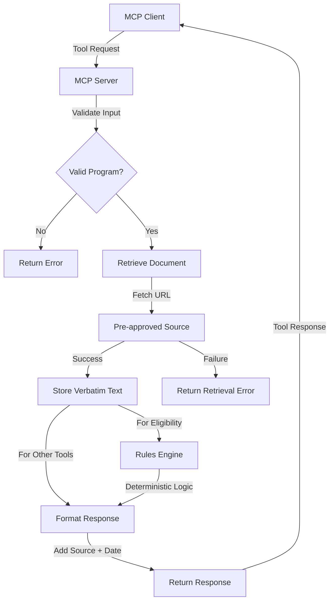

# Documentation Enhancement Plan

## Overview
Create comprehensive documentation package to make the retrieval-first MCP server production-ready and user-friendly.

## Documentation Structure

### 1. Deployment Guide (`docs/DEPLOYMENT.md`)

**Purpose:** Step-by-step instructions for deploying and configuring the server

**Contents:**
- Prerequisites (Node.js version, npm, etc.)
- Installation steps
- Environment variable configuration
  - OPENAI_API_KEY setup and where to obtain it
  - Optional configuration variables
- MCP Client Configuration
  - Claude Desktop (macOS and Windows)
  - Other MCP-compatible clients
  - Configuration file locations and formats
- Verification steps
  - Testing the installation
  - Using MCP Inspector for debugging
- Platform-specific notes
  - Windows considerations
  - macOS considerations
  - Linux considerations

**Example Configurations:**
```json
// Claude Desktop config example
{
  "mcpServers": {
    "plain-gov-mcp": {
      "command": "node",
      "args": ["/path/to/plain-gov-mcp/build/index.js"],
      "env": {
        "OPENAI_API_KEY": "your-api-key-here"
      }
    }
  }
}
```

---

### 2. Testing Documentation (`docs/TESTING.md`)

**Purpose:** Guide for testing and validating the server functionality

**Contents:**
- Testing with MCP Inspector
  - Installation and setup
  - Running the inspector
  - Interpreting results
- Manual Testing Scenarios
  - Test each tool with sample inputs
  - Expected outputs and validation
- Test Cases by Tool
  - `explain_program` - Test with each program_id
  - `get_eligibility_criteria` - Verify retrieval and formatting
  - `eligibility_check` - Test with various user contexts
  - `generate_checklist` - Validate checklist generation
  - `timeline` - Check date extraction
  - `questions_for_professional` - Verify question generation
- Error Handling Tests
  - Invalid program_id
  - Missing required parameters
  - Network failures (simulated)
  - Invalid user_context data
- Compliance Verification
  - Confirm retrieval-first operation
  - Verify source URLs in outputs
  - Check last_verified dates
  - Validate no prior knowledge usage

**Example Test Scenarios:**
```javascript
// Test Case 1: GST Credit Explanation
{
  "tool": "explain_program",
  "input": { "program_id": "gst_credit" },
  "expected": "Retrieved text with source URL and date"
}

// Test Case 2: Eligibility Check - Eligible
{
  "tool": "eligibility_check",
  "input": {
    "program_id": "gst_credit",
    "user_context": {
      "income": 45000,
      "province": "Canada"
    }
  },
  "expected": "status: eligible"
}
```

---

### 3. Contribution Guidelines (`docs/CONTRIBUTING.md`)

**Purpose:** Standards and procedures for contributing to the project

**Contents:**
- Code of Conduct
- How to Contribute
  - Reporting bugs
  - Suggesting enhancements
  - Submitting pull requests
- Development Setup
  - Forking and cloning
  - Installing dependencies
  - Running in development mode
- Adding New Programs
  - Source approval criteria
  - URL validation requirements
  - Adding to sources registry
  - Creating eligibility rules
  - Testing new programs
- Code Standards
  - TypeScript conventions
  - Error handling patterns
  - Documentation requirements
  - Commit message format
- Constraint Compliance
  - Retrieval-first principle enforcement
  - No prior knowledge usage
  - Verbatim text storage
  - Source attribution requirements
- Review Process
  - PR review checklist
  - Testing requirements
  - Documentation updates

**Adding a New Program Example:**
```typescript
// 1. Add to sources registry
const sources: Record<string, Source> = {
  // ... existing sources
  new_program: {
    id: 'new_program',
    name: 'New Program Name',
    url: 'https://official.gov.ca/program',
    jurisdiction: 'Canada',
    category: 'benefits'
  }
};

// 2. Add eligibility rules
const eligibilityRules = {
  // ... existing rules
  new_program: (userContext) => {
    // Conservative eligibility logic
  }
};
```

---

### 4. Troubleshooting Guide (`docs/TROUBLESHOOTING.md`)

**Purpose:** Common issues and solutions for users and developers

**Contents:**
- Installation Issues
  - Node.js version conflicts
  - npm install failures
  - Build errors
  - Permission issues
- Configuration Issues
  - MCP client not detecting server
  - Environment variables not loading
  - Path resolution problems
  - JSON configuration syntax errors
- Runtime Issues
  - Server not starting
  - Tools not appearing in client
  - Retrieval failures
  - Network timeout errors
  - OpenAI API errors
- Performance Issues
  - Slow response times
  - Memory usage concerns
- Debugging Techniques
  - Using MCP Inspector
  - Checking server logs
  - Validating configuration
  - Testing network connectivity
- Common Error Messages
  - "Program not found"
  - "Retrieval failed"
  - "Arguments are required"
  - OpenAI API errors

**Troubleshooting Matrix:**
| Symptom | Possible Cause | Solution |
|---------|---------------|----------|
| Server not starting | Missing dependencies | Run `npm install` |
| Tools not visible | Config file error | Validate JSON syntax |
| Retrieval failures | Network issues | Check internet connection |
| API errors | Invalid OPENAI_API_KEY | Verify API key |

---

### 5. Environment Setup Guide (`docs/ENVIRONMENT.md`)

**Purpose:** Detailed guide for environment configuration

**Contents:**
- Required Environment Variables
  - OPENAI_API_KEY
    - Where to obtain
    - How to set (per platform)
    - Security best practices
- Optional Environment Variables
  - NODE_ENV
  - Custom configuration options
- Platform-Specific Setup
  - Windows
    - Setting environment variables
    - Path configuration
  - macOS
    - Shell configuration (.zshrc, .bash_profile)
    - Keychain integration
  - Linux
    - Environment file setup
    - Systemd service configuration
- Security Considerations
  - API key protection
  - File permissions
  - Secrets management
- Development vs Production
  - Different configurations
  - Environment file usage (.env)

**Platform Examples:**

**Windows (PowerShell):**
```powershell
$env:OPENAI_API_KEY = "your-api-key"
```

**macOS/Linux (bash/zsh):**
```bash
export OPENAI_API_KEY="your-api-key"
```

**Claude Desktop Config:**
```json
{
  "mcpServers": {
    "plain-gov-mcp": {
      "command": "node",
      "args": ["/path/to/build/index.js"],
      "env": {
        "OPENAI_API_KEY": "your-api-key-here"
      }
    }
  }
}
```

---

### 6. Usage Examples (`docs/EXAMPLES.md`)

**Purpose:** Real-world scenarios demonstrating each tool

**Contents:**
- Introduction to Tools
- Scenario-Based Examples
  - Scenario 1: Understanding GST Credit
  - Scenario 2: Checking CCB Eligibility
  - Scenario 3: Small Business GST Registration
  - Scenario 4: Alberta Family Tax Credit
  - Scenario 5: Payroll Deductions Setup
- Tool-by-Tool Examples
  - explain_program examples
  - get_eligibility_criteria examples
  - eligibility_check examples (various contexts)
  - generate_checklist examples
  - timeline examples
  - questions_for_professional examples
- Complex Workflows
  - Multi-tool usage patterns
  - Combining tools for comprehensive analysis
- Output Interpretation
  - Understanding eligibility statuses
  - Reading source attributions
  - Interpreting missing information

**Example Scenarios:**

**Scenario 1: New Parent Checking Benefits**
```
User: "I just had a baby. What benefits am I eligible for?"

Step 1: Use explain_program for CCB
Input: { "program_id": "ccb" }
Output: [Retrieved text about Canada Child Benefit]

Step 2: Check eligibility
Input: {
  "program_id": "ccb",
  "user_context": {
    "income": 65000,
    "hasChildren": true,
    "childrenAges": [0],
    "province": "Canada"
  }
}
Output: Status: eligible

Step 3: Get checklist
Input: { "program_id": "ccb" }
Output: [Step-by-step application checklist]
```

**Scenario 2: Small Business Owner**
```
User: "Do I need to register for GST?"

Step 1: Explain GST registration
Input: { "program_id": "gst_registration" }

Step 2: Check eligibility
Input: {
  "program_id": "gst_registration",
  "user_context": {
    "taxableSupplies": 35000,
    "province": "Canada"
  }
}
Output: Status: eligible (supplies > $30,000)
```

---

### 7. Architecture Documentation (`docs/ARCHITECTURE.md`)

**Purpose:** Technical architecture and design decisions

**Contents:**
- System Overview
- Retrieval-First Architecture
  - Core principles
  - Design rationale
  - Constraint enforcement
- Architecture Diagram (Mermaid)
  - Request flow
  - Retrieval process
  - LLM integration (future)
  - Response generation
- Component Breakdown
  - Sources registry
  - Retrieval function
  - Eligibility rules engine
  - Tool handlers
  - Error handling
- Data Flow
  - Tool invocation
  - Document retrieval
  - Processing pipeline
  - Response formatting
- Design Decisions
  - Why retrieval-first
  - Why no LLM for eligibility
  - Why verbatim storage
  - Why fail loudly
- Compliance Mechanisms
  - Constraint validation
  - Source attribution
  - Error handling strategy
- Future Enhancements
  - LLM integration plans
  - Additional programs
  - Performance optimizations

**Architecture Diagram:**



**Request Flow:**
1. Client sends tool request with parameters
2. Server validates program_id against sources registry
3. Server retrieves document from pre-approved URL
4. For eligibility_check: Rules engine processes user_context
5. For other tools: Retrieved text formatted with source attribution
6. Response includes source URL and last_verified date
7. Client receives response

---

### 8. Main README Updates

**Purpose:** Update main README to link to all documentation

**Additions:**
- Documentation section with links
- Quick start guide
- Feature highlights
- Architecture overview link
- Contributing link
- License information

**New Documentation Section:**
```markdown
## Documentation

- [Deployment Guide](docs/DEPLOYMENT.md) - Installation and configuration
- [Testing Guide](docs/TESTING.md) - Testing and validation procedures
- [Usage Examples](docs/EXAMPLES.md) - Real-world scenarios and examples
- [Architecture](docs/ARCHITECTURE.md) - Technical design and architecture
- [Environment Setup](docs/ENVIRONMENT.md) - Environment variable configuration
- [Troubleshooting](docs/TROUBLESHOOTING.md) - Common issues and solutions
- [Contributing](docs/CONTRIBUTING.md) - Contribution guidelines
- [API Reference](docs/API.md) - Tool specifications and schemas
```

---

## Implementation Order

1. **DEPLOYMENT.md** - Critical for users to get started
2. **ENVIRONMENT.md** - Essential for proper configuration
3. **EXAMPLES.md** - Helps users understand tool usage
4. **ARCHITECTURE.md** - Provides technical context
5. **TESTING.md** - Enables validation and quality assurance
6. **TROUBLESHOOTING.md** - Supports users encountering issues
7. **CONTRIBUTING.md** - Enables community contributions
8. **README.md updates** - Ties everything together

---

## Quality Standards

Each document must:
- Be clear and concise
- Include practical examples
- Follow consistent formatting
- Be technically accurate
- Reference other docs where appropriate
- Include code examples where relevant
- Be accessible to target audience (users vs developers)

---

## Success Criteria

- Users can deploy the server without assistance
- Common issues have documented solutions
- Contributors understand how to add programs
- Architecture is clearly explained
- All tools have usage examples
- Testing procedures are comprehensive
- Environment setup is platform-specific and clear

---

## Next Steps

After creating all documentation:
1. Review for consistency and completeness
2. Test all examples and configurations
3. Validate all links and references
4. Get feedback from test users
5. Update based on feedback
6. Maintain documentation as project evolves