# End-to-End Testing Plan for PlainGov MCP

## Overview

This plan outlines a comprehensive end-to-end testing strategy to identify all issues with the PlainGov MCP server, with particular focus on the `gst_credit` program_id issue and ensuring all tool calls return successful (200) responses.

## Problem Statement

The `gst_credit` program_id is causing issues when passed to certain tools, resulting in error responses or incorrect behavior. We need to systematically test all tool/program combinations to identify which specific calls are failing.

## Testing Scope

### Tools to Test (6 total)
1. `explain_program`
2. `get_eligibility_criteria`
3. `eligibility_check`
4. `generate_checklist`
5. `timeline`
6. `questions_for_professional`

### Programs to Test (5 total)
1. `gst_credit` - GST/HST Credit (⚠️ Known issues)
2. `ccb` - Canada Child Benefit
3. `alberta_family_employment_tax_credit` - Alberta Family Employment Tax Credit
4. `gst_registration` - GST Registration for Small Business
5. `payroll_deductions` - Payroll Deductions for Small Business

### Test Matrix
**Total Combinations:** 6 tools × 5 programs = 30 test cases (basic)
**Plus:** eligibility_check variations with different user contexts = ~25 additional tests
**Total:** ~55 comprehensive test cases

## Test Architecture

### Test Structure

```
tests/
├── e2e/
│   ├── test-runner.ts          # Main test orchestrator
│   ├── test-cases.ts            # Test case definitions
│   ├── test-utils.ts            # Helper functions
│   ├── test-data.ts             # Test data fixtures
│   └── test-reporter.ts         # Results reporting
├── results/
│   └── test-results-[timestamp].json
└── README.md                    # Test execution guide
```

### Test Categories

#### 1. Basic Tool/Program Matrix Tests
Test each tool with each program_id to ensure:
- Request succeeds (no errors)
- Response is received
- Response includes required fields (source URL, verification date)
- Response format is correct

#### 2. Eligibility Check Comprehensive Tests
Test `eligibility_check` with:
- Valid contexts (eligible scenarios)
- Invalid contexts (not_eligible scenarios)
- Incomplete contexts (unclear scenarios)
- Edge cases (boundary conditions)

#### 3. Error Handling Tests
- Invalid program_id
- Missing required parameters
- Invalid parameter types
- Malformed requests

#### 4. Compliance Tests
- Source attribution present
- Verification dates included
- No prior knowledge used
- Proper error messages

## Test Implementation Strategy

### Phase 1: Test Infrastructure
1. Create test utilities for MCP communication
2. Implement test runner with parallel execution
3. Create result tracking and reporting system
4. Set up test data fixtures

### Phase 2: Basic Matrix Tests
1. Implement simple tool/program combination tests
2. Run initial sweep to identify failing combinations
3. Document all failures with details

### Phase 3: Deep Dive Tests
1. Implement eligibility_check variations
2. Add edge case tests
3. Add error handling tests

### Phase 4: Analysis & Reporting
1. Generate comprehensive test report
2. Categorize failures by type
3. Prioritize issues for fixing
4. Create issue tracking document

## Test Case Specifications

### Test Case Template

```typescript
interface TestCase {
  id: string;
  category: 'basic' | 'eligibility' | 'error' | 'compliance';
  tool: string;
  programId: string;
  arguments: Record<string, any>;
  expectedStatus: 'success' | 'error';
  expectedFields: string[];
  description: string;
}
```

### Example Test Cases

#### TC-001: explain_program with gst_credit
```json
{
  "id": "TC-001",
  "category": "basic",
  "tool": "explain_program",
  "programId": "gst_credit",
  "arguments": {
    "program_id": "gst_credit"
  },
  "expectedStatus": "success",
  "expectedFields": ["Source:", "last verified"],
  "description": "Test explain_program with gst_credit program_id"
}
```

#### TC-002: eligibility_check with gst_credit (eligible)
```json
{
  "id": "TC-002",
  "category": "eligibility",
  "tool": "eligibility_check",
  "programId": "gst_credit",
  "arguments": {
    "program_id": "gst_credit",
    "user_context": {
      "income": 45000,
      "province": "Canada"
    }
  },
  "expectedStatus": "success",
  "expectedFields": ["Eligibility Status: eligible", "Source:"],
  "description": "Test eligibility_check with gst_credit - eligible scenario"
}
```

## Test Data Fixtures

### Valid User Contexts by Program

```typescript
const validContexts = {
  gst_credit: {
    eligible: { income: 45000, province: "Canada" },
    notEligible: { income: 60000, province: "Canada" },
    unclear: { province: "Canada" }
  },
  ccb: {
    eligible: {
      income: 65000,
      hasChildren: true,
      childrenAges: [2, 4],
      province: "Canada"
    },
    notEligible: {
      income: 80000,
      hasChildren: true,
      childrenAges: [2, 4],
      province: "Canada"
    },
    unclear: {
      hasChildren: true,
      province: "Canada"
    }
  },
  // ... etc for other programs
};
```

## Expected Results

### Success Criteria
For each test case, verify:
- ✅ No errors thrown
- ✅ Response received
- ✅ Response contains expected fields
- ✅ Source URL present and valid
- ✅ Verification date present and formatted correctly
- ✅ Content is non-empty

### Failure Tracking
For each failure, capture:
- Test case ID
- Tool name
- Program ID
- Error message
- Stack trace (if available)
- Request parameters
- Timestamp

## Test Execution Plan

### Step 1: Setup
```bash
npm install
npm run build
```

### Step 2: Run Tests
```bash
npm run test:e2e
```

### Step 3: Review Results
- Check console output for summary
- Review detailed results in `tests/results/`
- Identify patterns in failures

### Step 4: Issue Documentation
- Create issue list from failures
- Categorize by severity
- Prioritize fixes

## Test Report Format

### Summary Section
```
Total Tests: 55
Passed: XX
Failed: XX
Success Rate: XX%

By Category:
- Basic Matrix: XX/30 passed
- Eligibility: XX/20 passed
- Error Handling: XX/5 passed
```

### Detailed Failures Section
```
FAILED: TC-001 - explain_program with gst_credit
Tool: explain_program
Program: gst_credit
Error: [Error message]
Request: { program_id: "gst_credit" }
Expected: Success with source URL
Actual: [Error details]
```

### Issue Tracking Section
```
Issue #1: gst_credit fails in explain_program
Severity: High
Affected Tools: explain_program, get_eligibility_criteria
Root Cause: [TBD after investigation]
Fix Priority: P0
```

## Mermaid Diagrams

### Test Execution Flow


### Test Categories Breakdown

```mermaid
graph LR
    A[E2E Tests] --> B[Basic Matrix]
    A --> C[Eligibility Tests]
    A --> D[Error Handling]
    A --> E[Compliance]
    
    B --> B1[6 Tools × 5 Programs]
    B1 --> B2[30 Test Cases]
    
    C --> C1[Valid Contexts]
    C --> C2[Invalid Contexts]
    C --> C3[Edge Cases]
    C1 --> C4[~20 Test Cases]
    C2 --> C4
    C3 --> C4
    
    D --> D1[Invalid Inputs]
    D --> D2[Missing Params]
    D1 --> D3[~5 Test Cases]
    D2 --> D3
```



## Implementation Priorities

### Priority 1: Critical Path (P0)
1. Test runner infrastructure
2. Basic matrix tests (all 30 combinations)
3. Initial failure identification
4. Basic reporting

### Priority 2: Deep Testing (P1)
1. Eligibility check variations
2. Error handling tests
3. Enhanced reporting with categorization

### Priority 3: Comprehensive Coverage (P2)
1. Compliance tests
2. Performance benchmarks
3. Detailed issue analysis

## Success Metrics

### Immediate Goals
- ✅ Identify all failing tool/program combinations
- ✅ Document specific error messages for each failure
- ✅ Create prioritized issue list
- ✅ Achieve 100% test execution (all 55+ tests run)

### Quality Goals
- ✅ Clear, actionable test reports
- ✅ Reproducible test cases
- ✅ Automated test execution
- ✅ Fast feedback loop (< 5 minutes for full suite)

## Next Steps

After test execution:
1. **Analyze Results** - Review all failures and patterns
2. **Root Cause Analysis** - Investigate why gst_credit fails
3. **Fix Issues** - Switch to Code mode to implement fixes
4. **Regression Testing** - Re-run tests after fixes
5. **Documentation** - Update docs with findings

## Tools & Technologies

- **Test Framework**: Custom TypeScript test runner
- **MCP Communication**: @modelcontextprotocol/sdk
- **Reporting**: JSON + Markdown reports
- **Execution**: Node.js 18+

## Risk Mitigation

### Potential Issues
1. **Network Failures**: Tests may fail due to connectivity
   - Mitigation: Retry logic, timeout handling
   
2. **Rate Limiting**: Too many requests to government sites
   - Mitigation: Throttling, delays between tests
   
3. **Flaky Tests**: Intermittent failures
   - Mitigation: Multiple runs, statistical analysis

## Deliverables

1. ✅ Test suite implementation (TypeScript)
2. ✅ Test execution script
3. ✅ Comprehensive test report (JSON + Markdown)
4. ✅ Issue tracking document
5. ✅ Test execution guide
6. ✅ Recommendations for fixes

---

## Implementation Status

### ✅ Completed Components

1. **Test Infrastructure** (Phase 1)
   - ✅ Test runner ([`test-runner.ts`](../tests/e2e/test-runner.ts))
   - ✅ Test utilities ([`test-utils.ts`](../tests/e2e/test-utils.ts))
   - ✅ Test data fixtures ([`test-data.ts`](../tests/e2e/test-data.ts))
   - ✅ Result tracking and reporting system
   - ✅ MCP client connection management

2. **Test Cases** (Phase 2)
   - ✅ Basic matrix test generation (30 test cases)
   - ✅ Automatic test case creation for all tool/program combinations
   - ✅ User context handling for eligibility_check

3. **Reporting System** (Phase 4)
   - ✅ JSON result format
   - ✅ Markdown report generation
   - ✅ Console progress display
   - ✅ Summary statistics
   - ✅ Test matrix visualization
   - ✅ Detailed failure tracking

4. **Documentation**
   - ✅ Comprehensive test execution guide ([`tests/README.md`](../tests/README.md))
   - ✅ Issue template ([`tests/ISSUE_TEMPLATE.md`](../tests/ISSUE_TEMPLATE.md))
   - ✅ NPM scripts for easy execution

### 🔄 Implementation Details

#### Test Runner Architecture

The test runner ([`test-runner.ts`](../tests/e2e/test-runner.ts:1)) implements:
- Sequential test execution with progress tracking
- Automatic MCP client lifecycle management
- Timestamped result files
- Latest results tracking (overwritten each run)
- Exit codes based on test results

#### Test Execution Flow

```typescript
// From test-runner.ts
async function runTests(): Promise<TestResult[]> {
  1. Connect to MCP server
  2. Generate 30 test cases (6 tools × 5 programs)
  3. Execute each test sequentially with 100ms delay
  4. Collect results with timing and error details
  5. Disconnect from server
  6. Return comprehensive results
}
```

#### Validation Logic

Each test validates ([`test-utils.ts`](../tests/e2e/test-utils.ts:66)):
- Response is not empty
- No error indicators in response text
- Source attribution is present
- Response format is correct

#### Test Data Structure

Test fixtures ([`test-data.ts`](../tests/e2e/test-data.ts:1)) include:
- 6 tools: `explain_program`, `get_eligibility_criteria`, `eligibility_check`, `generate_checklist`, `timeline`, `questions_for_professional`
- 5 programs: `gst_credit`, `ccb`, `alberta_family_employment_tax_credit`, `gst_registration`, `payroll_deductions`
- Valid user contexts for each program
- Program metadata with names and URLs

### 📊 Test Results Format

#### JSON Output Structure
```json
{
  "summary": {
    "total": 30,
    "passed": 25,
    "failed": 5,
    "successRate": "83.3%",
    "timestamp": "2026-01-11T18:00:00.000Z"
  },
  "results": [
    {
      "testId": "TC-001",
      "tool": "explain_program",
      "programId": "gst_credit",
      "status": "passed",
      "duration": 1234,
      "timestamp": "2026-01-11T18:00:00.000Z",
      "response": { /* full response */ }
    }
  ],
  "failedTests": [
    {
      "testId": "TC-002",
      "tool": "get_eligibility_criteria",
      "programId": "gst_credit",
      "error": "Error message",
      "errorDetails": "Stack trace or detailed error"
    }
  ]
}
```

#### Markdown Report Sections
1. **Summary** - Total, passed, failed, success rate
2. **Results by Tool** - Pass rate for each tool
3. **Results by Program** - Pass rate for each program
4. **Failed Tests Detail** - Full error information
5. **Test Matrix** - Visual grid showing all combinations

### 🚀 Execution Commands

```bash
# Full test suite (builds everything and runs)
npm run test:e2e

# Quick run (assumes already built)
npm run test:e2e:quick

# Build tests only
npm run build:tests
```

### 📁 Output Files

All results saved to `tests/results/`:
- `test-results-[timestamp].json` - Detailed results with full data
- `test-report-[timestamp].md` - Human-readable report
- `latest-results.json` - Most recent results (overwritten)
- `latest-report.md` - Most recent report (overwritten)

### 🔍 Known Issues & Focus Areas

#### Primary Investigation Target: `gst_credit`
The `gst_credit` program_id has been identified as problematic. The test suite will help determine:
- Which specific tools fail with `gst_credit`
- Whether failures are consistent or intermittent
- Error patterns and messages
- Comparison with other programs that work correctly

#### Expected Failure Patterns

Based on the problem statement, we expect to see:
1. **Tool-Specific Failures**: Some tools may fail with `gst_credit` while others succeed
2. **Consistent Errors**: Same error across multiple test runs
3. **Parameter Issues**: Possible program_id validation or lookup problems

### 📈 Success Metrics Tracking

The test suite tracks:
- ✅ **Coverage**: All 30 tool/program combinations tested
- ✅ **Reliability**: Consistent results across runs
- ✅ **Performance**: Test execution time (target: < 5 minutes)
- ✅ **Clarity**: Clear error messages for debugging

### 🔧 Troubleshooting Guide

#### Common Issues

**Issue: Tests fail to start**
```bash
# Solution: Rebuild everything
npm run build
npm run build:tests
```

**Issue: Connection errors**
- Verify `build/index.js` exists
- Check Node.js version (18+ required)
- Ensure no other process is using the MCP server

**Issue: All tests failing**
- Check internet connectivity
- Verify government websites are accessible
- Review server logs for startup errors

### 🎯 Next Steps After Test Execution

1. **Immediate Actions**
   - Run the test suite: `npm run test:e2e`
   - Review `tests/results/latest-report.md`
   - Identify all failing test cases
   - Document error patterns

2. **Analysis Phase**
   - Compare `gst_credit` failures with other programs
   - Identify root cause of failures
   - Determine if issue is in:
     - Program configuration
     - Tool implementation
     - Parameter handling
     - Source URL or scraping logic

3. **Fix Implementation**
   - Create issue list from test results
   - Prioritize fixes by severity
   - Implement fixes in source code
   - Re-run tests to verify fixes

4. **Regression Testing**
   - Run full test suite after each fix
   - Ensure fixes don't break other functionality
   - Document any new issues discovered

### 📚 Additional Resources

- **Test Execution Guide**: [`tests/README.md`](../tests/README.md)
- **Issue Template**: [`tests/ISSUE_TEMPLATE.md`](../tests/ISSUE_TEMPLATE.md)
- **Main Documentation**: [`docs/TESTING.md`](../docs/TESTING.md)
- **Architecture**: [`docs/ARCHITECTURE.md`](../docs/ARCHITECTURE.md)

### 🎓 Test Suite Features

#### Implemented Features
- ✅ Sequential test execution (avoids overwhelming server)
- ✅ Progress tracking with percentage display
- ✅ Detailed error capture with stack traces
- ✅ Response validation (source URLs, verification dates)
- ✅ Timing information for each test
- ✅ Automatic result file management
- ✅ Exit codes for CI/CD integration

#### Future Enhancements (Phase 3)
- ⏳ Parallel test execution option
- ⏳ Retry logic for flaky tests
- ⏳ Rate limiting for external requests
- ⏳ Performance benchmarking
- ⏳ Compliance validation tests
- ⏳ Edge case and error handling tests

### 📊 Test Coverage Matrix

| Category | Test Cases | Status |
|----------|-----------|--------|
| Basic Matrix | 30 | ✅ Implemented |
| Eligibility Variations | 0 | ⏳ Planned (Phase 3) |
| Error Handling | 0 | ⏳ Planned (Phase 3) |
| Compliance | 0 | ⏳ Planned (Phase 3) |
| **Total** | **30** | **30 Implemented** |

### 🏁 Conclusion

The E2E test suite is **fully implemented and ready for execution**. The infrastructure provides:
- Comprehensive coverage of all tool/program combinations
- Detailed reporting for issue identification
- Easy execution with NPM scripts
- Clear documentation for interpretation

**Current Status**: ✅ **Implementation Complete - Ready for Execution**

**Next Action**: Execute the test suite to identify all issues with the `gst_credit` program and other potential problems:
```bash
npm run test:e2e
```

**Estimated Execution Time**: 2-3 minutes for full suite (30 tests with 100ms delays)

---

**Document Version**: 2.0
**Last Updated**: 2026-01-11
**Status**: Complete - Implementation Finished