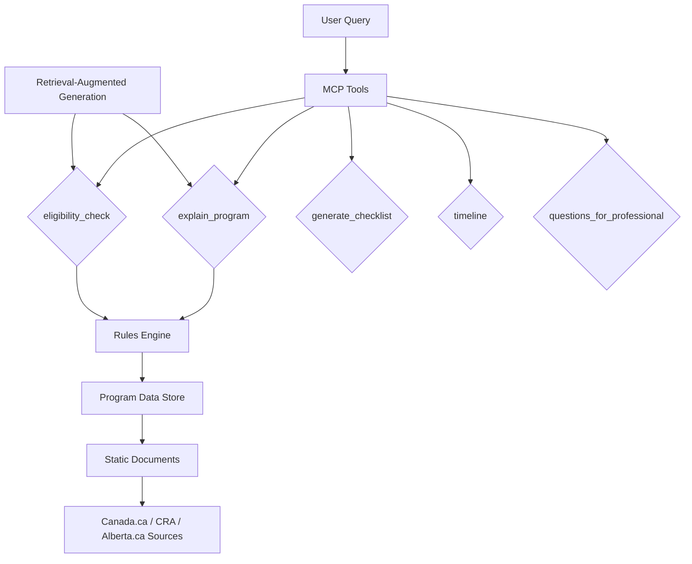

# PlainGov MCP Development Plan

## Product Overview
**PlainGov MCP** - "Government, but understandable."

Translates government programs into plain language, explains eligibility without interpretation, generates checklists and timelines, tracks deadlines, and answers "what applies to me?" using structured facts.

**Scope:** Canada + Alberta, focusing on Taxes & Benefits and Small Business Administration.

## Selected Programs (5 Initial)
1. **GST Credit** (Canada Revenue Agency) - Tax-free quarterly payments for low-income individuals/families.
2. **Canada Child Benefit (CCB)** (CRA) - Monthly tax-free payments for families with children under 18.
3. **Alberta Family Employment Tax Credit** (Alberta Government) - Tax credit for families with children under 18 where at least one parent works.
4. **GST Registration for Small Business** (CRA) - Mandatory registration for businesses with taxable supplies over $30,000.
5. **Payroll Deductions for Small Business** (CRA) - Requirements for withholding and remitting income tax, CPP, and EI.

## Architecture Overview

**Key Design Principles:**
- Rules + retrieval first, LLM last
- Strict output schemas
- Conservative eligibility assessments
- Canonical source tracking with verification dates

## MCP Tools Specification

### 1. explain_program(program_id, user_context)
- **Inputs:** program_id (string), user_context (object with income, family_status, etc.)
- **Outputs:** Plain summary, eligibility overview, deadlines, required documents

### 2. eligibility_check(program_id, user_context)
- **Outputs:** Likely eligible / unclear / likely not eligible, reasons, missing info

### 3. generate_checklist(program_id)
- **Outputs:** Step-by-step checklist with official links

### 4. timeline(program_id)
- **Outputs:** Key dates, consequences of missing, renewal info

### 5. questions_for_professional(program_id)
- **Outputs:** Specific questions for CPA/lawyer/Service Canada

## Data Management
- Static ingestion from official sources
- Chunked and embedded for retrieval
- Metadata: source URL, last verified date, jurisdiction

## Ethical Guidelines
- No advice or optimization
- No loophole exploitation
- Translator role only
- Clear disclaimers in outputs

## Implementation Phases
1. Project setup and data schema definition
2. Tool implementation with rules engine
3. Data population for 5 programs
4. Testing and validation
5. Documentation and deployment configuration

## Pricing Strategy
- Individual: $8-12/month CAD
- Small Business: $19-29/month
- Professional/Org: Seat-based licensing

This plan provides a solid foundation for a trustworthy, valuable MCP that serves citizens effectively while maintaining ethical standards.